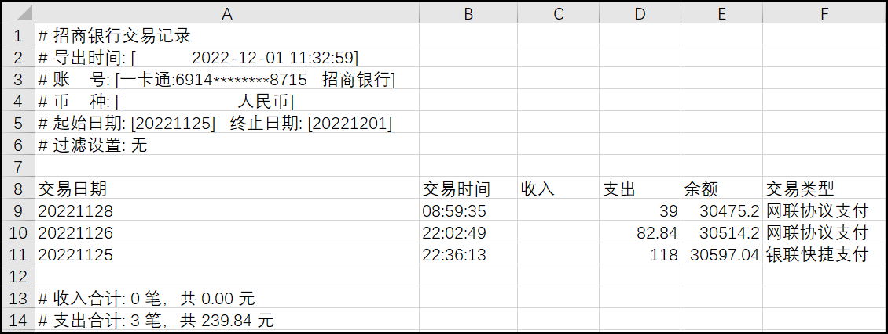
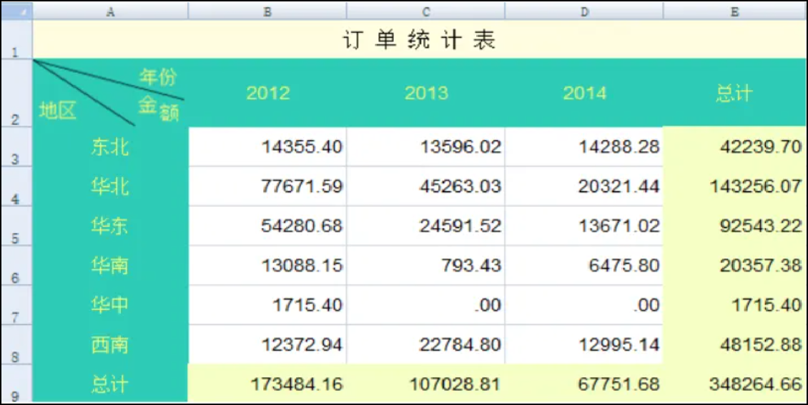
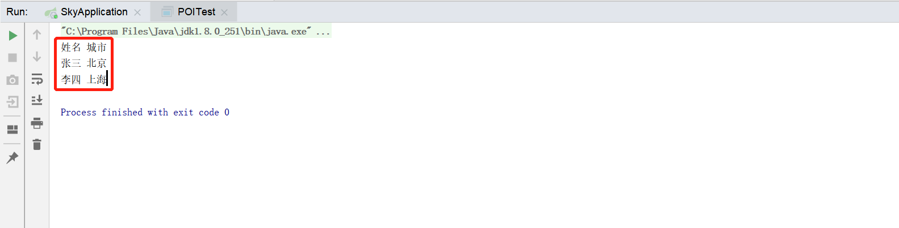

## 1. Apache POI

### 1.1 介绍

Apache POI 是一个处理Miscrosoft Office各种文件格式的开源项目。简单来说就是，我们可以使用 POI 在 Java 程序中对Miscrosoft Office各种文件进行读写操作。
一般情况下，POI 都是用于操作 Excel 文件。

 

**Apache POI 的应用场景：**

- 银行网银系统导出交易明细

   

- 各种业务系统导出Excel报表

   

- 批量导入业务数据

   


### 1.2 入门案例

Apache POI既可以将数据写入Excel文件，也可以读取Excel文件中的数据，接下来分别进行实现。

**Apache POI的maven坐标：**(项目中已导入)

```xml
<dependency>
    <groupId>org.apache.poi</groupId>
    <artifactId>poi</artifactId>
    <version>3.16</version>
</dependency>
<dependency>
    <groupId>org.apache.poi</groupId>
    <artifactId>poi-ooxml</artifactId>
    <version>3.16</version>
</dependency>
```


#### 1.2.1 将数据写入Excel文件

**1). 代码开发**

```java
package com.sky.test;

import org.apache.poi.xssf.usermodel.XSSFCell;
import org.apache.poi.xssf.usermodel.XSSFRow;
import org.apache.poi.xssf.usermodel.XSSFSheet;
import org.apache.poi.xssf.usermodel.XSSFWorkbook;
import java.io.File;
import java.io.FileInputStream;
import java.io.FileOutputStream;

public class POITest {

    /**
     * 基于POI向Excel文件写入数据
     * @throws Exception
     */
    public static void write() throws Exception{
        //在内存中创建一个Excel文件对象
        XSSFWorkbook excel = new XSSFWorkbook();
        //创建Sheet页
        XSSFSheet sheet = excel.createSheet("itcast");

        //在Sheet页中创建行，0表示第1行
        XSSFRow row1 = sheet.createRow(0);
        //创建单元格并在单元格中设置值，单元格编号也是从0开始，1表示第2个单元格
        row1.createCell(1).setCellValue("姓名");
        row1.createCell(2).setCellValue("城市");

        XSSFRow row2 = sheet.createRow(1);
        row2.createCell(1).setCellValue("张三");
        row2.createCell(2).setCellValue("北京");

        XSSFRow row3 = sheet.createRow(2);
        row3.createCell(1).setCellValue("李四");
        row3.createCell(2).setCellValue("上海");

        FileOutputStream out = new FileOutputStream(new File("D:\\itcast.xlsx"));
        //通过输出流将内存中的Excel文件写入到磁盘上
        excel.write(out);

        //关闭资源
        out.flush();
        out.close();
        excel.close();
    }
    public static void main(String[] args) throws Exception {
        write();
    }
}
```

**2). 实现效果**

在D盘中生成itcast.xlsx文件，创建名称为itcast的Sheet页，同时将内容成功写入。

 


#### 1.2.2 读取Excel文件中的数据

**1). 代码开发**

```java
package com.sky.test;

import org.apache.poi.xssf.usermodel.XSSFCell;
import org.apache.poi.xssf.usermodel.XSSFRow;
import org.apache.poi.xssf.usermodel.XSSFSheet;
import org.apache.poi.xssf.usermodel.XSSFWorkbook;
import java.io.File;
import java.io.FileInputStream;
import java.io.FileOutputStream;

public class POITest {
    /**
     * 基于POI读取Excel文件
     * @throws Exception
     */
    public static void read() throws Exception{
        FileInputStream in = new FileInputStream(new File("D:\\itcast.xlsx"));
        //通过输入流读取指定的Excel文件
        XSSFWorkbook excel = new XSSFWorkbook(in);
        //获取Excel文件的第1个Sheet页
        XSSFSheet sheet = excel.getSheetAt(0);

        //获取Sheet页中的最后一行的行号
        int lastRowNum = sheet.getLastRowNum();

        for (int i = 0; i <= lastRowNum; i++) {
            //获取Sheet页中的行
            XSSFRow titleRow = sheet.getRow(i);
            //获取行的第2个单元格
            XSSFCell cell1 = titleRow.getCell(1);
            //获取单元格中的文本内容
            String cellValue1 = cell1.getStringCellValue();
            //获取行的第3个单元格
            XSSFCell cell2 = titleRow.getCell(2);
            //获取单元格中的文本内容
            String cellValue2 = cell2.getStringCellValue();

            System.out.println(cellValue1 + " " +cellValue2);
        }

        //关闭资源
        in.close();
        excel.close();
    }

    public static void main(String[] args) throws Exception {
        read();
    }
}

```


**2). 实现效果**

将itcast.xlsx文件中的数据进行读取

 