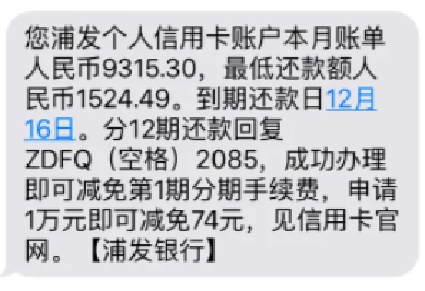
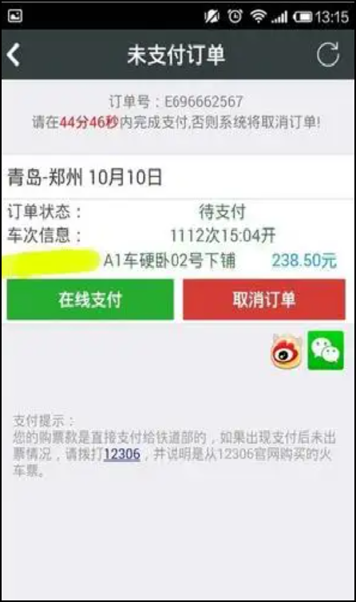
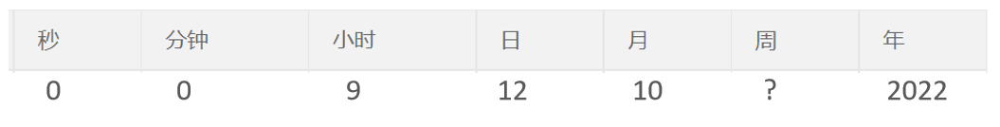

## 1. Spring Task

### 1.1 介绍

**Spring Task** 是Spring框架提供的任务调度工具，可以按照约定的时间自动执行某个代码逻辑。

**定位：**定时任务框架

**作用：**定时自动执行某段Java代码


  为什么要在Java程序中使用Spring Task？

**应用场景：**

1). 信用卡每月还款提醒

 


2). 银行贷款每月还款提醒

 


3). 火车票售票系统处理未支付订单

 


4). 入职纪念日为用户发送通知

 


**强调：**只要是需要定时处理的场景都可以使用Spring Task


### 1.2 cron表达式

**cron表达式**其实就是一个字符串，通过cron表达式可以**定义任务触发的时间**

**构成规则：**分为6或7个域，由空格分隔开，每个域代表一个含义

每个域的含义分别为：秒、分钟、小时、日、月、周、年(可选)

**举例：**

2022年10月12日上午9点整 对应的cron表达式为：**0 0 9 12 10 ? 2022**

 

**说明：**一般**日**和**周**的值不同时设置，其中一个设置，另一个用？表示。


**比如：**描述2月份的最后一天，最后一天具体是几号呢？可能是28号，也有可能是29号，所以就不能写具体数字。

为了描述这些信息，提供一些特殊的字符。这些具体的细节，我们就不用自己去手写，因为这个cron表达式，它其实有在线生成器。

cron表达式在线生成器：https://cron.qqe2.com/

 


可以直接在这个网站上面，只要根据自己的要求去生成corn表达式即可。所以一般就不用自己去编写这个表达式。

**通配符：**

\* 表示所有值； 

? 表示未说明的值，即不关心它为何值； 

\- 表示一个指定的范围； 

, 表示附加一个可能值； 

/ 符号前表示开始时间，符号后表示每次递增的值；

**cron表达式案例：**

*/5 * * * * ? 每隔5秒执行一次

0 */1 * * * ? 每隔1分钟执行一次

0 0 5-15 * * ? 每天5-15点整点触发

0 0/3 * * * ? 每三分钟触发一次

0 0-5 14 * * ? 在每天下午2点到下午2:05期间的每1分钟触发 

0 0/5 14 * * ? 在每天下午2点到下午2:55期间的每5分钟触发

0 0/5 14,18 * * ? 在每天下午2点到2:55期间和下午6点到6:55期间的每5分钟触发

0 0/30 9-17 * * ? 朝九晚五工作时间内每半小时

0 0 10,14,16 * * ? 每天上午10点，下午2点，4点 


### 1.3 入门案例

#### 1.3.1 Spring Task使用步骤

1). 导入maven坐标 spring-context（已存在）

 

2). 启动类添加注解 @EnableScheduling 开启任务调度

3). 自定义定时任务类


#### 1.3.2 代码开发

**编写定时任务类：**

进入sky-server模块中

```java
package com.sky.task;

import lombok.extern.slf4j.Slf4j;
import org.springframework.scheduling.annotation.Scheduled;
import org.springframework.stereotype.Component;

import java.util.Date;

/**
 * 自定义定时任务类
 */
@Component
@Slf4j
public class MyTask {

    /**
     * 定时任务 每隔5秒触发一次
     */
    @Scheduled(cron = "0/5 * * * * ?")
    public void executeTask(){
        log.info("定时任务开始执行：{}",new Date());
    }
}
```

**开启任务调度：**

启动类添加注解 @EnableScheduling

```java
package com.sky;

import lombok.extern.slf4j.Slf4j;
import org.springframework.boot.SpringApplication;
import org.springframework.boot.autoconfigure.SpringBootApplication;
import org.springframework.cache.annotation.EnableCaching;
import org.springframework.scheduling.annotation.EnableScheduling;
import org.springframework.transaction.annotation.EnableTransactionManagement;

@SpringBootApplication
@EnableTransactionManagement //开启注解方式的事务管理
@Slf4j
@EnableCaching
@EnableScheduling
public class SkyApplication {
    public static void main(String[] args) {
        SpringApplication.run(SkyApplication.class, args);
        log.info("server started");
    }
}
```


#### 1.3.3 功能测试

启动服务，查看日志

 

每隔5秒执行一次。
